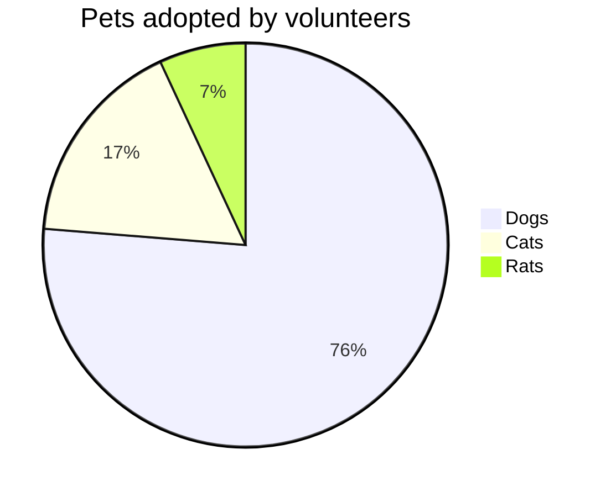

|              Stage | Direct Products | ATP Yields |
| -----------------: | --------------: | ---------: |
|         Glycolysis |          2 ATP              ||
| ^^                 |          2 NADH |   3--5 ATP |
| Pyruvaye oxidation |          2 NADH |      5 ATP |
|  Citric acid cycle |          2 ATP              ||
| ^^                 |          6 NADH |     15 ATP |
| ^^                 |          2 FADH |      3 ATP |
|                               30--32 ATP        |||


<p>{{ page.date | timeago }}</p>

###### 国际象棋

|--|--|--|--|--|--|--|--|
|♜| |♝|♛|♚|♝|♞|♜|
| |♟|♟|♟| |♟|♟|♟|
|♟| |♞| | | | | |
| |♗| | |♟| | | |
| | | | |♙| | | |
| | | | | |♘| | |
|♙|♙|♙|♙| |♙|♙|♙|
|♖|♘|♗|♕|♔| | |♖|

###### 单元格内联属性

{:color-style: style="background: black;"}
{:color-style: style="color: white;"}
{:text-style: style="font-weight: 800; text-decoration: underline;"}

|:             Here's an Inline Attribute Lists example                :||||
| ------- | ------------------ | -------------------- | ------------------ |
|:       :|:  <div style="color: red;"> &lt; Normal HTML Block > </div> :|||
| ^^      |   Red    {: .cls style="background: orange" }                |||
| ^^ IALs |   Green  {: #id style="background: green; color: white" }    |||
| ^^      |   Blue   {: style="background: blue; color: white" }         |||
| ^^      |   Black  {: color-style text-style }                         |||

###### 数学公式

1. $ a * b = c ^ b $
2. $ 2^{\frac{n-1}{3}} $
3. $ \int\_a^b f(x)\,dx. $

###### UML的使用

```plantuml!
Bob -> Alice : hello world
```
或者

@startuml
Bob -> Alice : hello world2
@enduml

###### 美人鱼的使用



或者

@startmermaid
pie title Pets adopted by volunteers
  "Dogs" : 386
  "Cats" : 85
  "Rats" : 35
@endmermaid

###### 混合HTML与Markdown


# Hybrid HTML with Markdown is a not bad choice ^\_^

## Table Usage

| :        Fruits \|\| Food       : |||
| :--------- | :-------- | :--------  |
| Apple      | : Apple : | Apple      \
| Banana     |   Banana  | Banana     \
| Orange     |   Orange  | Orange     |
| :   Rowspan is 4    : || How's it?  |
|^^    A. Peach         ||   1. Fine :|
|^^    B. Orange        ||^^ 2. Bad   |
|^^    C. Banana        ||  It's OK!  |

## PlantUML Usage

@startuml
Bob -> Alice : hello
@enduml

## Video Usage


:smiley: